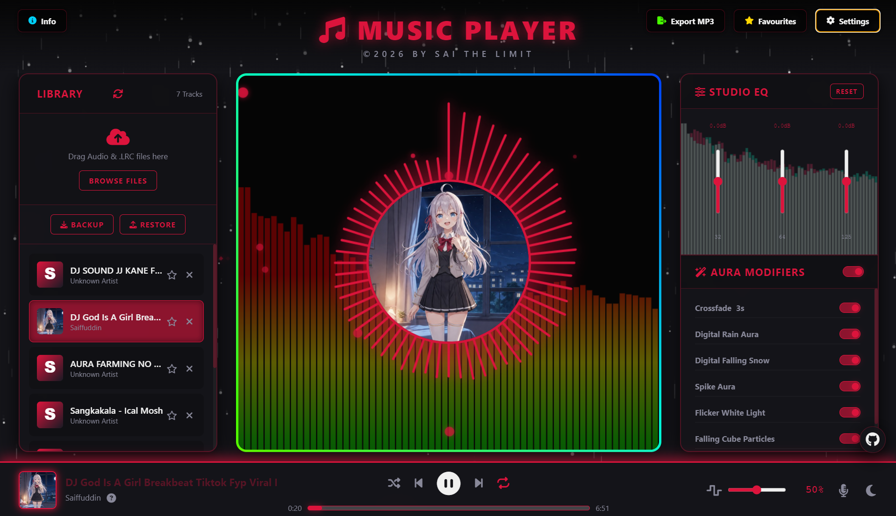

# 🎵 MUSIC PLAYER | AURA ENGINE V1.0

Welcome to **AURA ENGINE**, a premium, client-side glassmorphic music streaming companion crafted with high-fidelity studio customizability. Experience synchronized visuals, deep equalizer tuning, dynamic audio modifiers, and seamless workflow export tools directly inside your browser.



---
## ✨ Advanced Engineering Features

* **Dual-Workspace Library Layer:** Toggle on-the-fly between a persistent local browser library (powered by IndexedDB) and a high-performance **Music Directory Folder Scanner** utilizing temporary local file tree pointers.
* **Aura Visualizer Matrix:** Dynamic digital rainfall matrix, falling winter snow patterns, soundwave spiral silhouettes, expanding explosive vector matrices, and rhythmic beat-popping geometry calculations syncing automatically with real-time sub-bass frequencies.
* **Dual-Channel Stereo Equalizer:** Integrated 10-band master audio hardware filter array tracking frequencies from 32Hz to 16kHz, supplemented by dedicated independent Pre-Amplifier gain nodes, manual acoustic panning balances, and specialized Sub-Bass focus tracks.
* **Aura Modifier Rack:** Real-time software acoustic convolution reverb mapping engines, high-precision playback velocity pitch scaling, custom crossfade scheduling transitions, and immediate geometric element color presets (Ruby, Gold, Emerald, Sapphire, etc.).
* **Smart Media Metadata Core:** Seamlessly parses structural file metadata and binary artwork streams on structural file loading paths using localized `jsmediatags` logic arrays.
* **Client-Side Audio Multi-Pass Encoding:** Process, render, and record edited master tracks natively within your browser using custom `OfflineAudioContext` multi-pass pipelines, writing directly into standard continuous bitrates via optimized Web Assembly libraries (`lamejs`).

---

## 📥 Installation & Setup

You can download and run this web app locally on your machine via the command line. Open your terminal or Git Bash and execute the following block:

```bash
# 1. Clone the repository from GitHub
git clone [https://github.com/sfmuhammmad327-wq/Music-Player-Aura-V1.0.git](https://github.com/sfmuhammmad327-wq/Music-Player-Aura-V1.0.git)

# 2. Navigate into the project folder
cd Music-Player-Aura-V1.0

# 3. Launch the app instantly in your default browser
# For Windows:
start index.html

# For Mac:
open index.html

# For Linux:
xdg-open index.html
```

## 🕹️ Detailed User Instructions
### 1. Feeding Your Media Library
Standard Mode: Drag and drop audio standard wrappers (.mp3, .wav, .flac, .ogg, .m4a) combined with matching named karaoke parameters (.lrc) onto the central uploading zone.

Directory Scan Mode: Flip the interface module layout, choose Select Folder, and let the script safely map extensive localized drive partitions instantly.

### 2. Synchronization & Karaoke Tuning
To secure ideal temporal accuracy, ensure your lyrics text references match the exact name tracking configuration of the target audio format (e.g., TrackTitle.mp3 and TrackTitle.lrc).

Hit the B shortcut key or use the targeted footer icon to engage Lyrics Focus Mode to replace the ambient art deck with scrolling text layers responding smoothly to master progress times.

### 3. Workspace Data Protection & Recovery
Use the structural backup modules to record your settings profiles, audio database pointers, and custom key indexing arrays straight into a standalone .json backup layer file for instantaneous recovery paths.

---

## ⌨️ Global Keyboard Shortcuts

Master the app using these immediate hotkey assignments:

| Key Mapping | Control Action |
| :--- | :--- |
| `Space` | Play / Pause |
| `J` / `K` | Previous Track / Next Track |
| `H` / `L` | Seek Backward / Forward |
| `Arrow Left` / `Arrow Right` | Alternative Seek Controls |
| `R` / `S` | Toggle Track Loop / Playlist Shuffle |
| `N` | Toggle Dark / Light Visual Layout Mode |
| `B` | Toggle Focus Lyrics Overlay Mode |
| `M` | Mute Volume Deck Output |
| `D` | Toggle Footer Deck Value Adjust Menu |
| `1`, `2`, `3` | Fast Select Deck Adjustment Target Mode (Volume/Speed/Reverb) |
| `Ctrl + ◄` / `►` | Incrementally Adjust Selected Slider Value Deck |

---

## 🔒 Privacy & Local Database
All imported music tracks, system settings, and custom favorites list structures are kept locally inside your browser via custom **IndexedDB** architectures. **No audio data or private metadata vectors are ever sent to external cloud servers.**

👑 Credit
Designed and developed with absolute passion by:

Muhammad Saiffuddin Bin Ahmad Fauzi Known as Sai the Limited

🚀 High-Tier Competitive Strategy & Graphics Systems Engineer

📧 Inquiries: sfmuhammmad327@gmail.com

© 2026 BY SAI THE LIMIT. All Rights Reserved.
